<div align="center">

# `lanafaga091-create`

### Developer • Linux • Automation • Cybersecurity • AI

<p>
  
</p>

</div>

---

## 👋 About

I'm a developer and technology enthusiast who enjoys building practical projects, experimenting with Linux environments, automation, web applications, and controlled cybersecurity labs.

```text
┌──────────────────────────────────────────────────┐
│                  PROFILE STATUS                  │
├──────────────────────────────────────────────────┤
│  OS / LAB     Linux • Debian • Termux            │
│  FOCUS        Web • Automation • Security        │
│  BUILD        Tools • Scripts • Applications     │
│  APPROACH     Learn → Build → Test → Improve     │
└──────────────────────────────────────────────────┘
```

---

## ⚙️ What I Work With

| Area | Focus |
|---|---|
| 🐧 Linux | Debian, Termux, XFCE, shell environments |
| 🌐 Web | Websites, dashboards, modern UI |
| 🤖 AI | AI-assisted development and automation |
| 🔐 Security | Authorized testing, labs, networking |
| ⚡ Automation | Bash, scripts, workflows |
| 📦 Open Source | GitHub projects and reusable tools |

---

## 🧰 Tech Stack

<div align="center">


</div>

---

## 🔐 Security & Networking

<div align="center">


</div>

> Security projects are intended for learning, authorized testing, defensive research, and isolated laboratories.

---

## 📊 GitHub Overview

<div align="center">


</div>

---

## 🎯 Current Focus

<div align="center">

| Focus | Direction |
|:---:|---|
| 🐧 | Linux & Debian environments |
| 🌐 | Web application development |
| 🤖 | AI-assisted development |
| 🔐 | Security research & controlled labs |
| ⚡ | Automation & developer tooling |
| 📱 | Android / Termux workflows |

</div>

---

## 🚀 Project Direction

```text
IDEA
 │
 ▼
BUILD ───────► TEST
 │               │
 ▼               ▼
IMPROVE ◄───── DEBUG
 │
 ▼
SHARE
```

I prefer projects that are useful, understandable, and easy to improve.

---

### 🎯 CURRENT MISSION

```text
[████████████████████░░] 90%

BUILD     ████████████████████
LEARN     ██████████████████░░
RESEARCH  ████████████████░░░░
TEST      █████████████████░░░
IMPROVE   ███████████████████░
```

---

## 🛡️ Security Principles

- Test only systems where permission is granted.
- Keep experiments inside controlled environments.
- Protect credentials and user data.
- Document findings clearly.
- Prefer defensive learning and responsible disclosure.
- Turn experiments into safer, reusable knowledge.

---

## 📌 Featured Repositories

<div align="center">

| Repository | Description |
|---|---|
| [🛡️ **cyber-security**](https://github.com/lanafaga091-create/cyber-security) | Open learning space for cybersecurity: guidebooks, Kali Linux on Termux, Debian/Ubuntu setup, website security, and professional techniques (Markdown notes) |
| [🚀 **Rekomendasi-ai-agent-**](https://github.com/lanafaga091-create/Rekomendasi-ai-agent-) | Debian developer tools collection: installation guides for Odysseus, G0DM0D3, and OpenCode, plus troubleshooting |
| [🛒 **PasarKita**](https://github.com/lanafaga091-create/PasarKita) | Web project: PasarKita |

<a href="https://github.com/lanafaga091-create?tab=repositories">
  
</a>

</div>

---

## 🌐 GitHub

<div align="center">

<a href="https://github.com/lanafaga091-create">
  
</a>

<br><br>

### `BUILD • TEST • LEARN • IMPROVE`

</div>

---

<div align="center">



</div>
